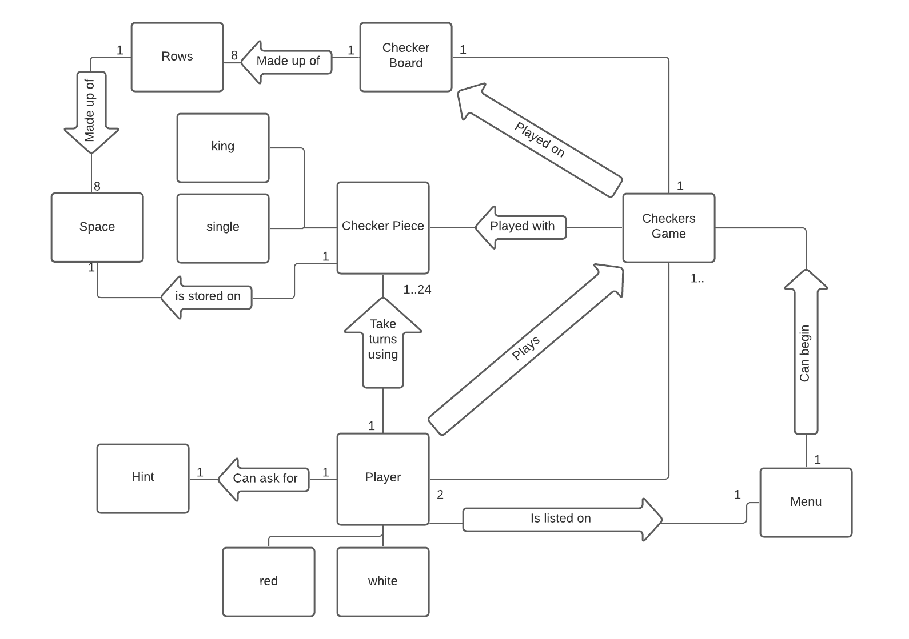
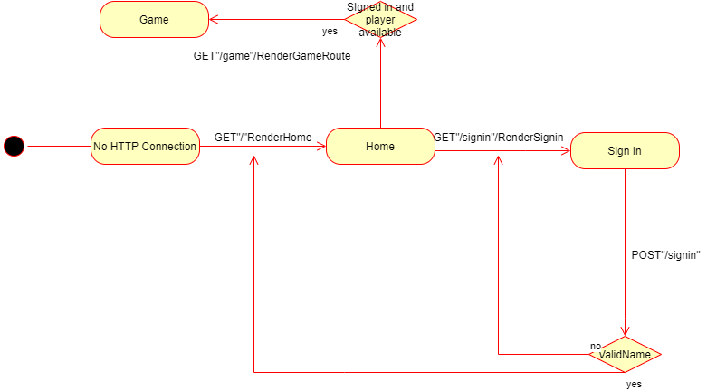
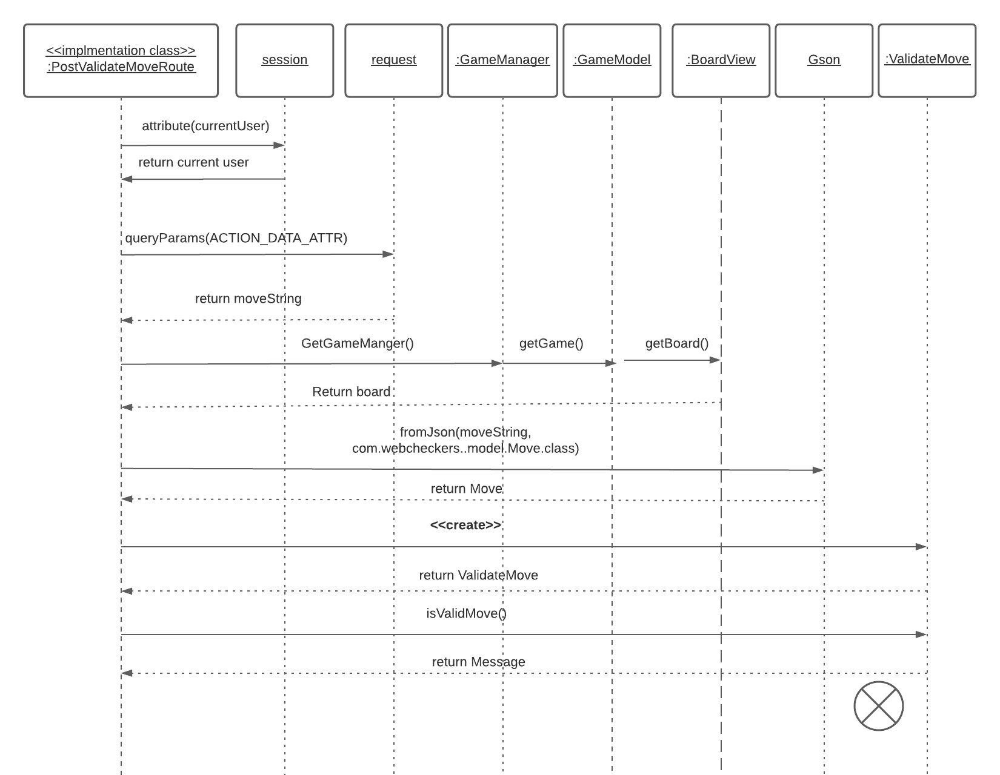
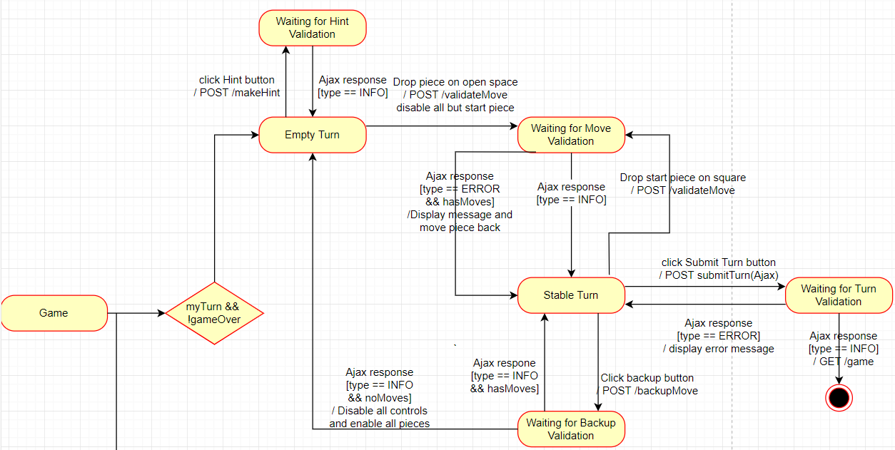
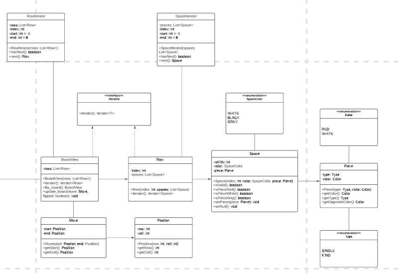

# Web Checkers Design Documentation

## Team Information
* Team name: thePurpleNarwhals
* Team members
  * Michael Taylor
  * Greg Villafane
  * Huan Huynh
  * Andrew Chacon

## Executive Summary
The application must allow players to play checkers with other players who are currently signed in.
The game user interface (UI) will support a game experience using drag-and-drop browser capabilities
for making moves. Beyond this minimal set of features, we have grand vision for how we could further enhance
the player experience with some additional features beyond the basic checkers game.

### Purpose
Create a web-based Checkers game using Maven and Freemarker, implementing
the game through frontend and backend development. Each player should be able to 
successfully play a game of checkers.

### Glossary and Acronyms

| Term | Definition |
|------|------------|
| VO | Value Object |

## Requirements

This section describes the features of the application.

### Definition of MVP

A user should be able to sign in to start playing checkers. A user once signed in
can start a game with another player. Each player should be able to play a standard game of
checkers and have the option to resign during the game.

### MVP Features

* As a user I want to be able to sign in with the desired username of my choice.
* As a user I want to be able to start a game and play with another.
* As a user I want to be able to move a piece when I drag a piece to a valid square.
* As a user I want to be able to capture a piece when I drag a piece over an opponent's piece.
* As a user I want to be able to forfeit the game when I feel helpless to end the game.

### Roadmap of Enhancements

* Provide a button to give a hint to the Player.
* The hint will return a list of possible moves the PLayer can make.
* The Player can start multiple games at the same time and switch between the games.

## Application Domain

This section describes the application domain.

A list of Players will be in a menu after signing in. A Player will play a Checkers game,
making the move using the pieces. The Game has a Board for the game to be played on. The
Board is made up of Rows and Spaces, which the pieces will be stored on. The Player can then make
a Move to progress the game. A Player can play multiple games at the same time and also get a hint
during the game.

## Architecture and Design

This section describes the application architecture.

### Summary

The following Tiers/Layers model shows a high-level view of the webapp's architecture.

As a web application, the user interacts with the system using a
browser.  The client-side of the UI is composed of HTML pages with
some minimal CSS for styling the page.  There is also some JavaScript
that has been provided to the team by the architect.

The server-side tiers include the UI Tier that is composed of UI Controllers and Views.
Controllers are built using the Spark framework and View are built using the FreeMarker framework.  The Application and Model tiers are built using plain-old Java objects (POJOs).

Details of the components within these tiers are supplied below.

### Overview of User Interface

This section describes the web interface flow; this is how the user views and interacts
with the WebCheckers application.

The user will go to the home page when first coming to the application. The user will
then be able to get to the /signin page. If the name entered is valid, then they will be
taken to the /home page. If the name entered is invalid, then they will stay at the /signin
page. When the user is signed in and at the home page, the user will then be able to get to the
/game page to play a game. `GET /GameRoute` is called to begin the game. Drag and drop mechanics
are used to move the checkers from square to square. Buttons are used to submit the turn, undo the move,
resign the game, and receive a hint. The page will refresh periodically to update the board once the
opponent submits their turn or resigns the game.

### UI Tier

Provide summary, add sequence diagrams/statecharts, go through what gets called as the game progresses.

The UI is composed of the routes needed to properly navigate the website and
play the game. All routes created inherit from the `Route` interface.
The user starts at the home route, then `GET /signin` is called to allow
the user to log in. After a successful log-in, the user is taken back to the homepage, 
where `GET /GameRoute` is called when a Player clicks on another Player to begin the game.

In the Game, if it is your turn, when a move is made, `POST /ValidateMove` is called which will
verify the move is legal. If the move is legal and the submit button is pressed, then `POST
/SubmitTurn` is called, which will update the board and allow the opponent to move. This process
repeats until the game is over. Figure 4 shows the sequence diagram of `PostValidateMoveRoute`.

If a move is made and the Player wants to undo the move, then `PostBackupMoveRoute` is called, which
puts the board back in its previous state. If the Player wants a hint, then `PostMakeHintRoute` is called,
which will generate the hint and return it to the board. Figure 5 shows the connection of these
routes.

If it is not your turn, then the page will continuously refresh until the turn updates. This is done
by calling `PostCheckTurnRoute` every 5 seconds to refresh the page. If it is the end of the game, then
`PostResignGameRoute` is called to end the game, which updates the Game page and hides all buttons except
the button to exit the game.

### Application Tier

When a user goes to sign in, their name is put in the `PlayerLobby` to be stored. If
the name entered is already in the lobby, then the name is invalid and the user will have to
use a different name to sign in. When a game is started, the `GameManager` will put the players 
in a game and create the board.

### Model Tier

When a user successfully signs in, they now become a `Player` in the lobby. When 
the players start a game, the `Boardview` represents the board, which consists of `Row`s
and `Space`s, which the `Piece`s are then placed on. A `GameModel` is also used to represent one game.
When a move is made on the board, a `Move` is created, which contains the start and end `Position` of 
the piece moved. The `ValidateMove` class is then used to verify whether the move was valid. If the user requests
it, a hint can be made using `MakeHint`.

### Design Improvements

While Object-Oriented principles are followed, the use and consistency of them
are not apparent throughout the architecture. The Law of Demeter, in particular, is
a principle that could be improved throughout the design. In addition, there are some
classes that have been replaced with new classes, but have not been removed from the architecture.
This causes issues with coupling and can be fixed by replacing the obsolete classes with their successor
in the design, as well as implementing more abstraction so the issue can be avoided in the future. In addition,
refactoring can be done to separate concerns within the main tiers. Classes within the tiers should be put into
packages to separate classes that focus on different aspects of the program.

In addition, the code metrics yield some areas of improvement across multiple categories. The lines of code
metric show that each class has at most 139 lines of code, with one exception. `ValidateMove` has 238
lines of code, which is high compared to the rest of the project. This can be fixed by breaking the class in
to smaller classes. The complexity metric show that `ValidateMove` and `GetGameRoute` are more complex than the rest of
the classes. This is due to the complexity of the methods involved in the classes. This can be fixed by breaking down
the methods within the class or breaking up the responsibility of the class in to smaller classes. The Chidamber-Kemerer
metric show that `ValidateMove` has a high method complexity relative to the rest of the classes. In addition, the classes
have good cohesion with each other. The Javadoc metric show that comments are sparse throughout the project and could be
improved upon. The Martin packaging metrics show that the UI tier calls from classes that are outside the package
and the Model tier has methods that are called from outside the package. This shows that data from the Model tier is exchanged
heavily with the UI tier. In addition, the application tier has coupling with the other tiers. The number of calls can be
reduced by creating controller classes in each package that will handle any data that must be communicated between
packages. This will funnel the transfer of data and reduce coupling between the packages.

## Testing
> _This section will provide information about the testing performed
> and the results of the testing._

Unit testing was performed on some of the UI tier and the Application tier.

### Acceptance Testing
> _Report on the number of user stories that have passed all their
> acceptance criteria tests, the number that have some acceptance
> criteria tests failing, and the number of user stories that
> have not had any testing yet. Highlight the issues found during
> acceptance testing and if there are any concerns._

No stories have passed all their tests, 
three stories have some acceptance criteria passed, and four have none passed.

### Unit Testing and Code Coverage
> _Discuss your unit testing strategy. Report on the code coverage
> achieved from unit testing of the code base. Discuss the team's
> coverage targets, why you selected those values, and how well your
> code coverage met your targets. If there are any anomalies, discuss
> those._

More unit tests have to be done to get a more complete coverage at this time.
